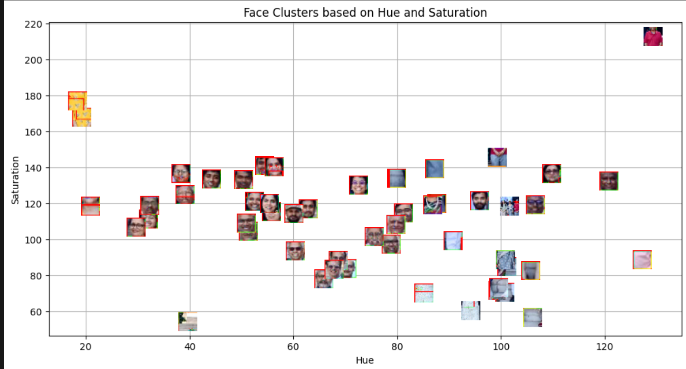
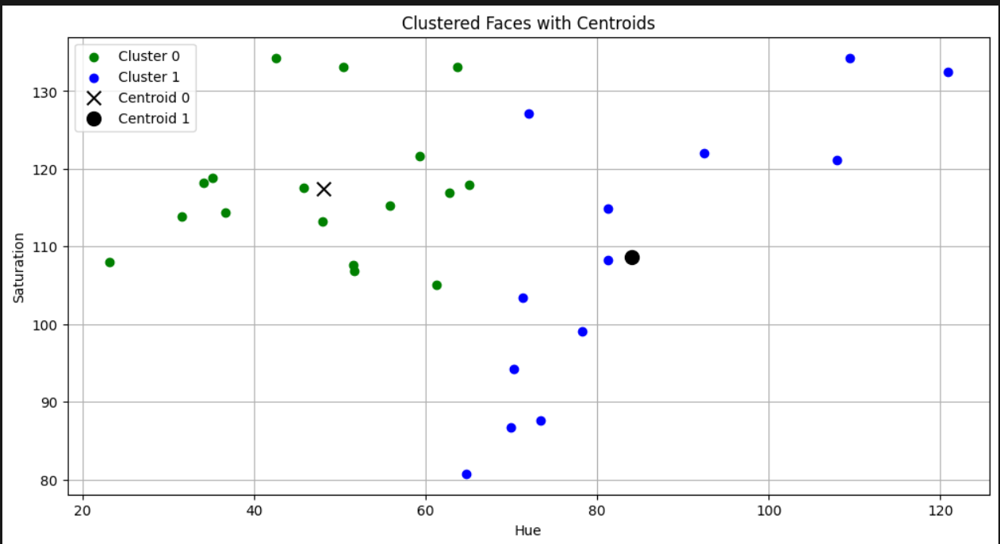
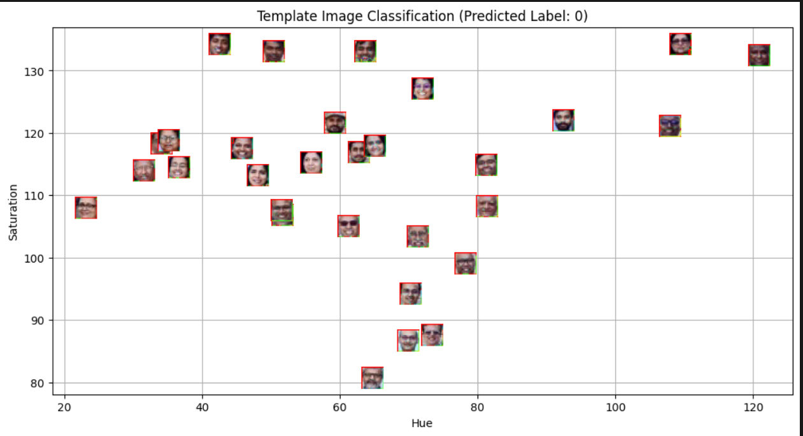
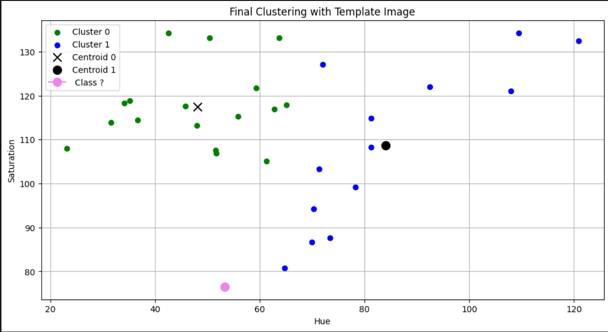

# Lab 5: Face Clustering using K-Means

## Aim
The aim of this lab is to use the K-Means clustering algorithm to group detected faces based on color features (Hue and Saturation) and to classify a new template image into one of these generated clusters.

## Methodology
1. **Face Detection:** Read the main image and detected faces using OpenCV's Haar Cascade classifier.
2. **Feature Extraction:** Converted the detected face regions from BGR to HSV color space. Extracted the mean Hue and Saturation values for each face to use as data points.
3. **K-Means Clustering:** Applied the K-Means algorithm with k=2 to group the faces into two distinct clusters based on their extracted features.
4. **Template Matching:** Detected the face in a template image, extracted its mean Hue and Saturation, and used the trained K-Means model to predict which cluster it belongs to.

## Key Findings
* The extracted Hue and Saturation features allowed the K-Means algorithm to successfully separate the detected faces into two distinct clusters.
* The centroids effectively represented the average color profile of each group.
* The model was able to successfully take a new template image and assign it to the correct cluster based on the nearest centroid in the feature space.

## Conclusions
This assignment demonstrates that basic color features like Hue and Saturation can be used to cluster and group image segments. While this works well for grouping by color similarity, more complex feature extraction methods would be needed for actual facial recognition.

## Visualisations

### 1. Face Clusters based on hue and saturation

 
### 2. Clustered faces with centroids

### 3. Template Image Classification

### 4. Final Clustering with Template Image

